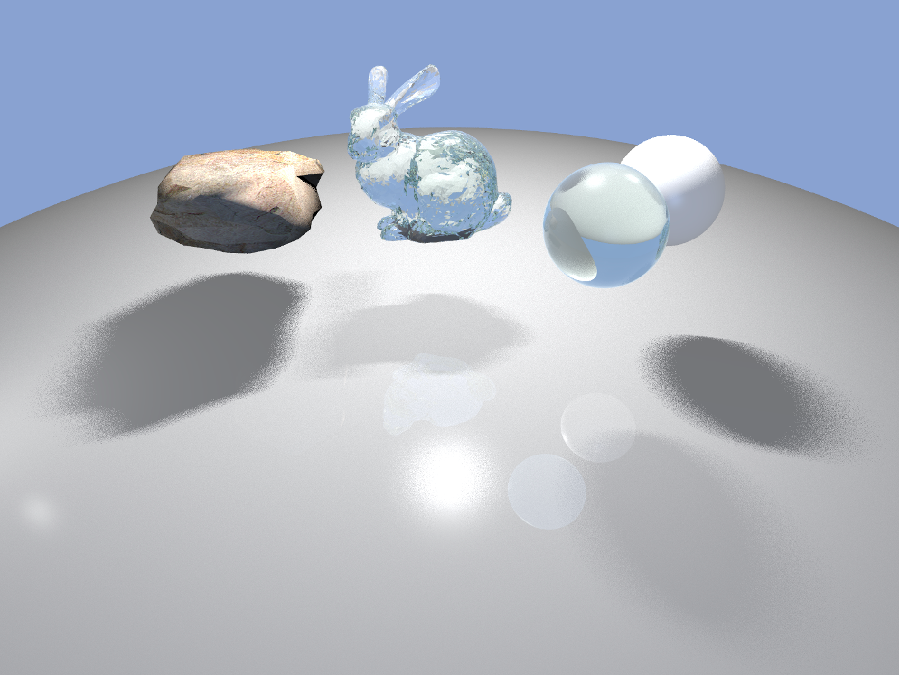

# ShabbyRenderer  

  
<p>
    
    
</p>


This repository contains a trivial implementation of pure-CPU ray tracer, which supports some basic features: 
* Simple loaders for materials and triangular-meshes    
* Simple ppm writer
* Anti-aliasing(via stratified sampling)  
* Texture mapping
* BVH accelerated ray-object intersection
* Transparent material  
* Ideal mirror reflection  
* Hard shadow for point light
* Soft shadow for area light
* Blurred soft shadow for composited area light
* Parallel rendering(using openMP)
* Orthogonal camera available too
* Supports point light, area light, parallel light, ambient light

## How To Build  

1. Get Eigen3  
Eigen is a C++ template library for linear algebra: matrices, vectors, numerical solvers, and related algorithms.  
You can also refer Eigen's official page( http://eigen.tuxfamily.org/) if you want to build Eigen on your own.  
```bash  
# For Ubuntu
sudo apt update
sudo apt install libeigen3-dev
```

2. Get dependencies(lodepng, a png loader to load png texture)  
```bash
cd 'project dir'
git submodule init
git submodule update
```

3. Build ShabbyRenderer
```bash
cd 'project dir'
mkdir build
cd build
cmake ..
make
```

## How to Run
```bash
cd build
./ShabbyRenderer
```